<!-- ═══════════════════════════════════════════════════════════
     TAPE 05 · SIDE A — recovered from github.com/5kyscream
     palette: ink #070606 · blood #C1121F / #E5383B · bone #ECE4D4
     ═══════════════════════════════════════════════════════════ -->

<div align="center">



<br/>


<br/>


</div>



```text
SUBJECT ............ Prathmesh Raghuvanshi
ALIAS .............. 5kyscream
LAST KNOWN ......... B.Tech IT · Manipal University Jaipur
                     SWE intern · Vykon Indus Technologies (Future Lab R&D)
OBSESSIONS ......... systems programming · AI/ML · product design
CURRENT CASE ....... DsaDojo — 1v1 competitive DSA, refereed by an AI
SIDE EXPERIMENT .... an LSM-tree key-value store, in C++, from scratch
ON REPEAT .......... DPR IAN — Moodswings In To Order
LAST SEEN .......... somewhere between a segfault and a deploy
```



<div align="center">
<a href="https://github.com/5kyscream/DSAdojo">
  
</a>
</div>



<div align="center">


<br/>

<br/>


</div>



<div align="center">


</div>







<div align="center">

<a href="https://instagram.com/avganxietyenjoyer"></a>
<a href="https://linkedin.com/in/prathmesh-raghuvanshi-7a75a5232"></a>
<a href="https://x.com/damn_where"></a>
<a href="mailto:prathmeshsingh22@gmail.com"></a>

<br/><br/>


</div>
